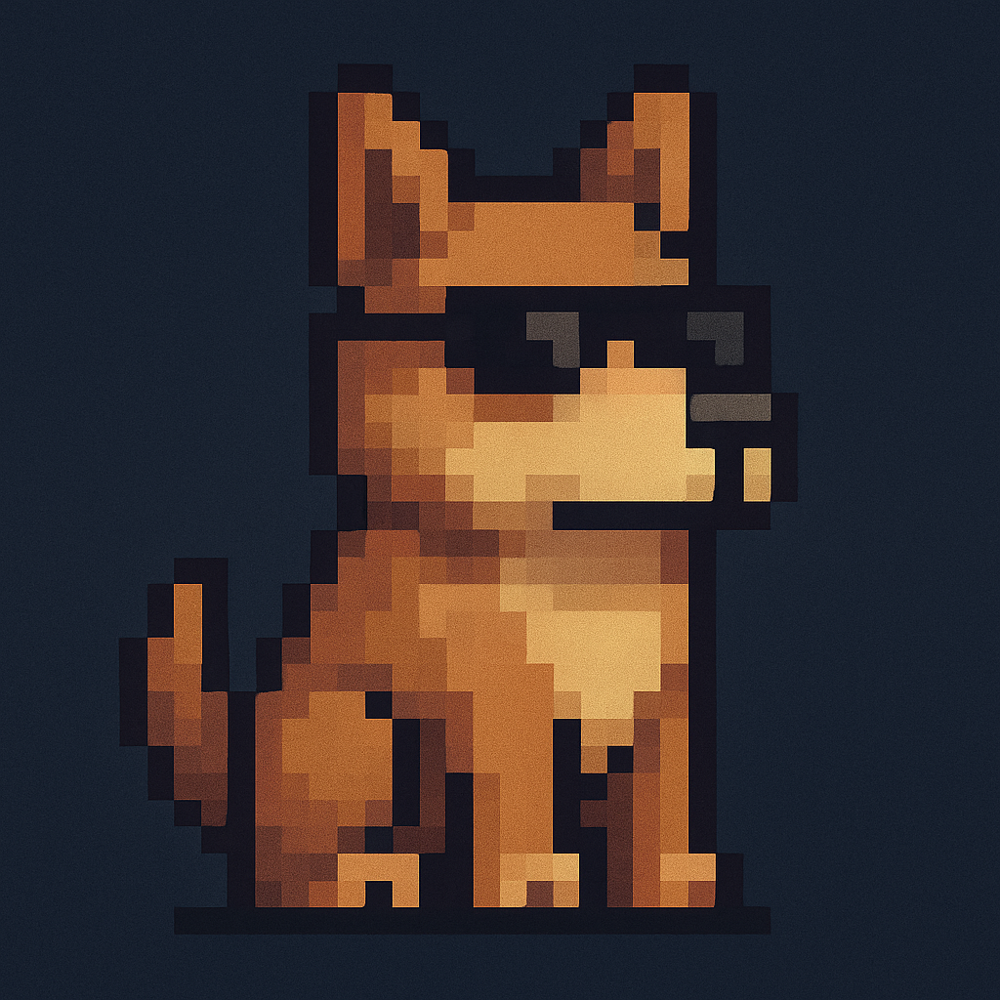

(Versão em português)
Este projeto é uma ferramenta de linha de comando (CLI), ainda em protótipo que atua como um "watchdog" para programas Linux.
Ele executa qualquer binário passado como argumento, redireciona a saída padrão e de erro para arquivos .log, e cria um relatório detalhado contendo o horário de execução e o código de saída. Ideal para depuração ou automação simples de testes.

(English Version)
This project is a CLI tool, still in development that acts like a "watchdog" for linux programs
It executes any binary passed as argument, redirects the standart output and error output to some files .log, and creates a detailed report that contains the hour and the minute of execution. Perfect for debug or simple tests

