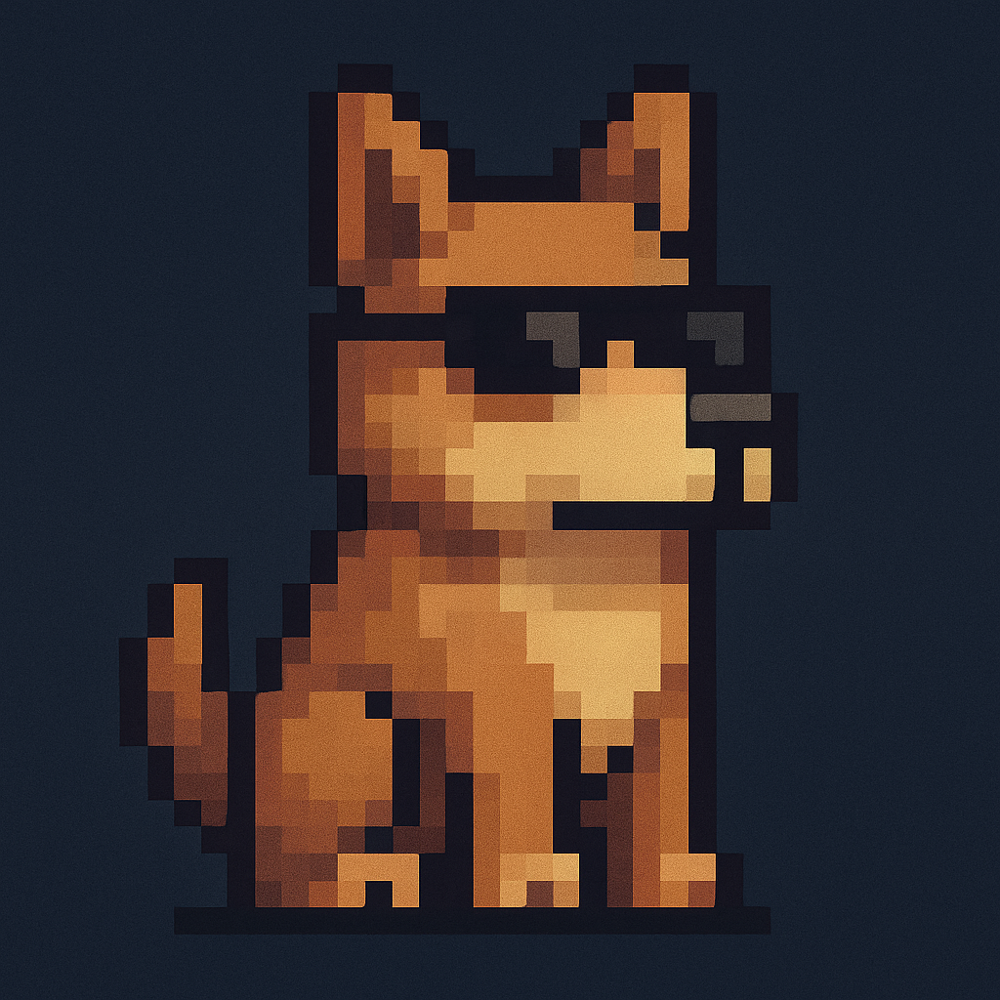

Este projeto é uma ferramenta de linha de comando (CLI), ainda em protótipo que atua como um "watchdog" para programas Linux.
Ele executa qualquer binário passado como argumento, redireciona a saída padrão e de erro para arquivos .log, e cria um relatório detalhado contendo o horário de execução e o código de saída. Ideal para depuração ou automação simples de testes.

